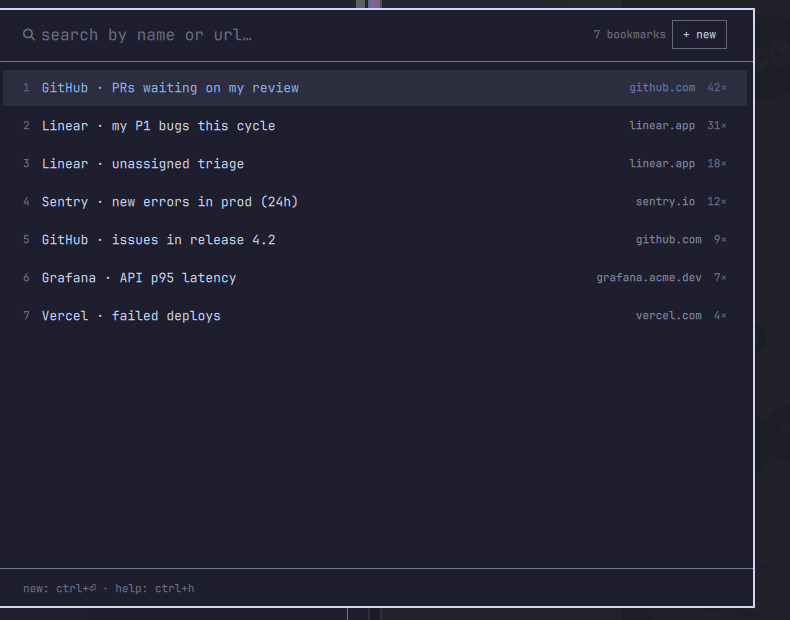

# Bookmarks

A filtered view is a URL. This plugin stores those URLs with a name and
opens them from a searchable overlay, so the filters you rebuild by hand
in GitHub, Linear or anywhere else are one keystroke away.



## Install

```bash
git clone https://github.com/bitcero/ech-omarchy-bookmarks.git \
  ~/.config/omarchy/plugins/bitcero.bookmarks
omarchy-restart-shell
```

Then bind a key in `~/.config/hypr/bindings.lua`:

```lua
o.bind("SUPER + SHIFT + V", "Bookmarks", "omarchy-shell shell toggle bitcero.bookmarks")
```

## Use

| Action | Keys |
|---|---|
| filter by name or url | type |
| move | `↑` `↓` |
| open in the browser | `⏎` |
| save a new bookmark | `ctrl+⏎` |
| edit the selected one | `ctrl+e` |
| copy its url | `alt+c` |
| delete it | `supr` or `shift+backspace` |
| change where bookmarks are stored | `ctrl+,` |
| clear the filter, then close | `esc` |
| show this list | `ctrl+h` |

The list is ordered by how often you open each bookmark.

## Storage

`~/.local/state/omarchy/bitcero-bookmarks.json` by default. Change it with
`ctrl+,` and the file moves to the new path. If bookmarks already exist
at the destination, those win and the current file stays where it is, so
pointing several machines at one synced directory does the right thing.

## Tests

```bash
node --test tests/store.test.js
```

## License

MIT
